# Reasoning effort is not an intelligence slider

## Introduction

Reasoning effort entered LLM products disguised as an ordinary control: *low*, *medium*, *high*. It looks like a quality setting. It is closer to a budget. Raising the value does not make the model more knowledgeable; it changes the policy governing how much inference-time work the same model can spend before it answers.

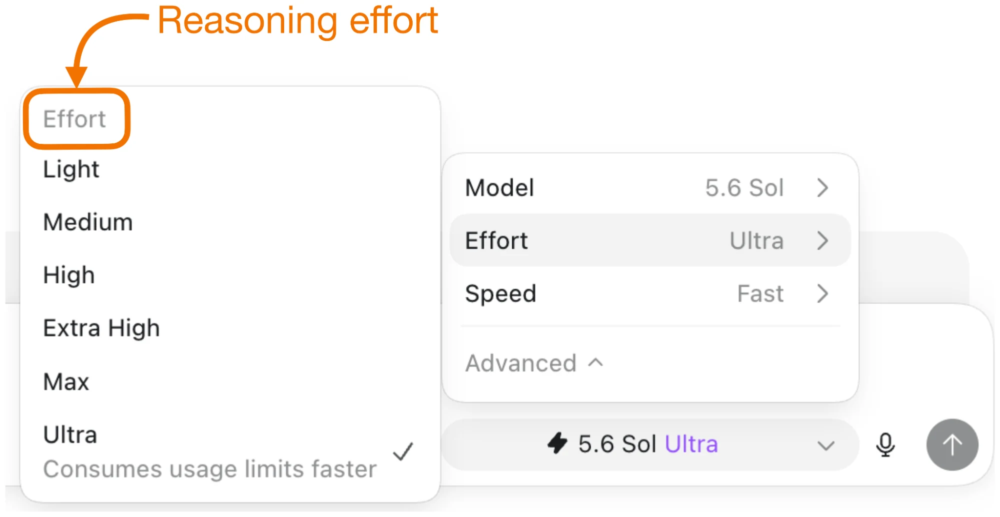

*This is what reasoning effort looks like at the product surface: a second axis beside model choice, not a different model. Public Codex capture from [Sebastian Raschka’s survey](https://magazine.sebastianraschka.com/p/controlling-reasoning-effort-in-llms).*

On a single request, that distinction may seem academic. Across a long-running agent, it governs hidden generation, latency, cache reuse, and how much of a finite budget is spent planning rather than acting. Raising effort indiscriminately wastes compute. Holding it too low can starve the few decisions on which the rest of a run depends.

A few years ago, developers tried to elicit reasoning by writing “think step by step,” supplying worked examples, or sampling several answers and voting. Then models were trained to produce useful intermediate work. Providers began charging for hidden reasoning tokens. Open-weight releases exposed the training recipes. Agent harnesses learned to vary the budget from one step to the next. What began as a prompting technique has become a layer of inference infrastructure, often still treated as a UI preference.

> Reasoning effort is not an intelligence slider. It is an inference-time compute policy — and the right default is the lowest level that makes the system work reliably.

To understand what the selector means—and why providers and agent harnesses cannot simply hide it forever—we need to follow the path by which reasoning became something engineers could budget.

## How reasoning became a budget

### 2022: reasoning was something you prompted for

The modern story starts before there was an effort field. The chain-of-thought paper showed that sufficiently large language models could solve some multi-step problems more accurately when prompts included worked intermediate reasoning. Self-consistency then showed a second route to better results: sample several different reasoning paths and select the answer they most often reach. One method spent more tokens inside a trajectory; the other spent more compute across trajectories. Both established the idea that inference could be scaled after training.[^cot][^self-consistency]

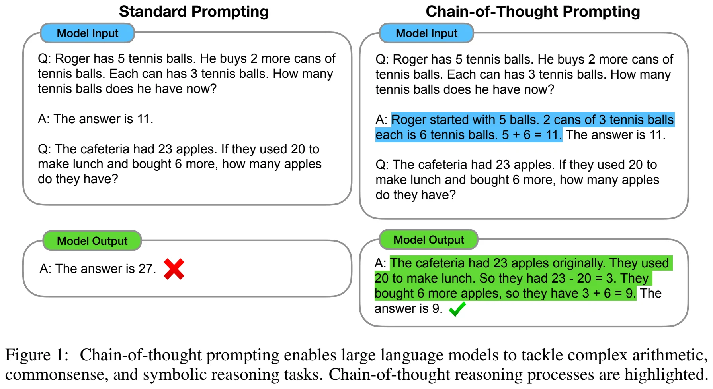

*Wei et al.’s opening figure made the result concrete: intermediate steps changed the answer, while the model and question stayed the same. Figure 1 from [the original paper](https://arxiv.org/abs/2201.11903).*

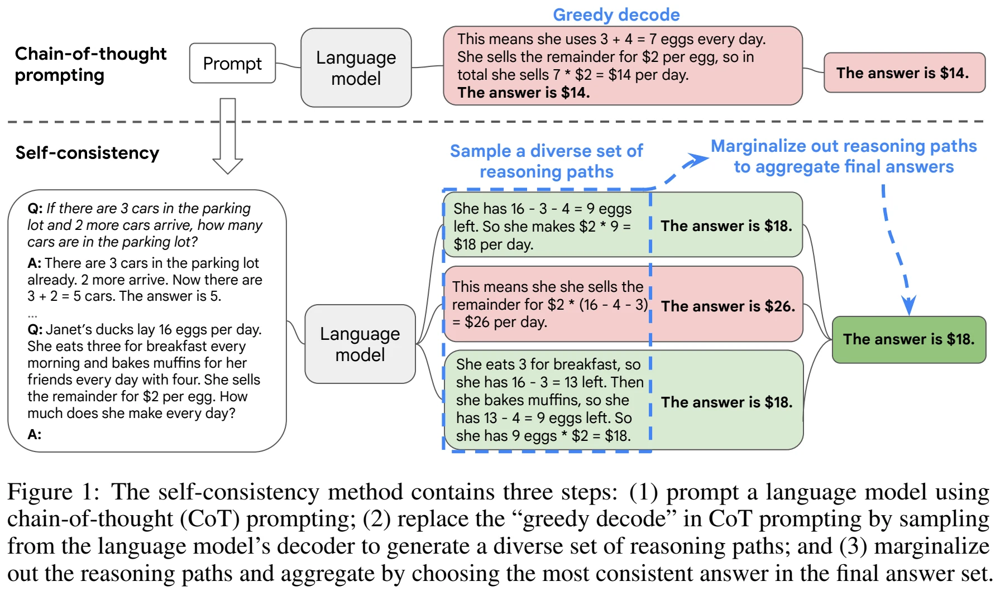

*The other 2022 route to better answers spent compute across trajectories rather than inside one: sample several reasoning paths, then keep the answer they agree on. Figure 1 from [Wang et al.](https://arxiv.org/abs/2203.11171)*

At this stage, the developer owned the machinery. A prompt encouraged a trace, a sampling loop created alternatives, and application code chose the result. “Reasoning effort” was an emergent consequence of prompting and decoding, not a calibrated model capability.

### 2023: the process became a training target

The next step moved reasoning from prompt craft into post-training. Work on process supervision compared rewarding correct intermediate steps with rewarding only the final outcome. In mathematics, OpenAI reported that process-supervised reward models selected correct solutions more reliably than outcome-supervised ones as more candidate solutions were considered. This did not settle the general training recipe, but it made a central design question explicit: should a model learn from the path, the destination, or both?[^process-supervision]

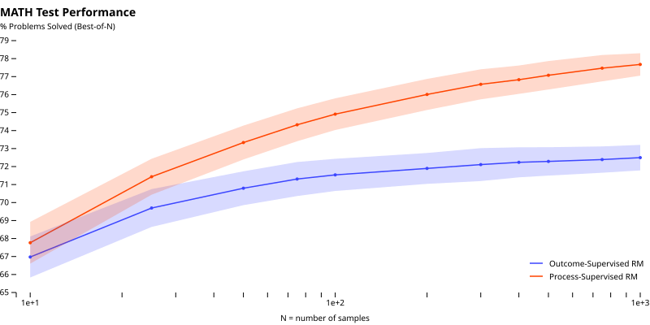

*Process supervision did more than improve one score: its advantage widened as the evaluator chose among more candidate solutions. Chart from [OpenAI’s process-supervision study](https://openai.com/index/improving-mathematical-reasoning-with-process-supervision/).*

Verifiable domains such as mathematics and code offered another possibility. If a checker can determine whether the final answer or program is correct, reinforcement learning can reward successful behavior without requiring a human to annotate every hidden step. That idea would become central to the open reasoning-model wave.

### September 2024: test-time compute became a product

OpenAI’s o1 release was the moment the shift became visible to ordinary API users. OpenAI described a model trained with reinforcement learning to refine its chain of thought, recognize mistakes, and try other approaches, and reported that performance improved with both train-time compute and time spent thinking at inference. Raw chain-of-thought was withheld, while a model-generated summary could be shown. The internal trajectory had become a metered product behavior rather than prompt text the application necessarily owned.[^o1]

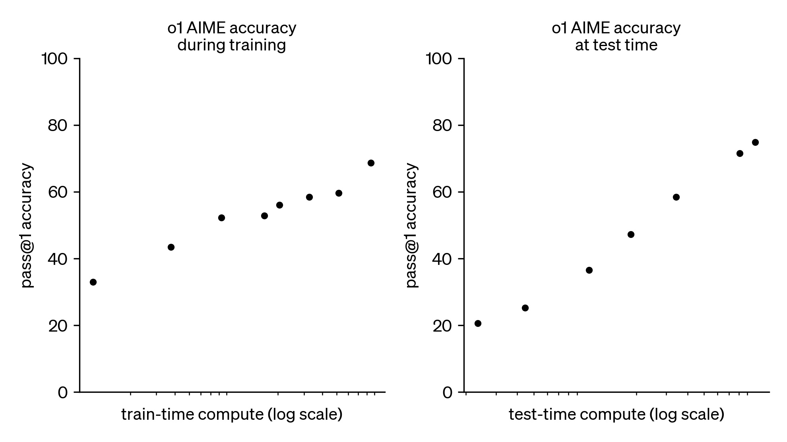

*The o1 launch made the new scaling axis explicit: performance rose not only with training compute, but also with compute spent after the prompt arrived. Figure from [OpenAI’s o1 release](https://openai.com/index/learning-to-reason-with-llms/).*

This changed the engineering question. Developers no longer asked only, “How should I prompt the model to reason?” They also had to ask, “How much invisible generation should this request be allowed to consume, how do I measure it, and when does the extra latency pay off?”

### January 2025: open weights exposed the recipe

DeepSeek-R1 made the training story inspectable. R1-Zero applied large-scale reinforcement learning before supervised fine-tuning and developed longer reasoning, reflection, and self-correction. The full R1 pipeline added cold-start data and further training for readability and general usefulness, then distilled the behavior into smaller models. The release turned techniques that had largely been inferred from closed systems into code, weights, and a detailed report.[^deepseek-r1]

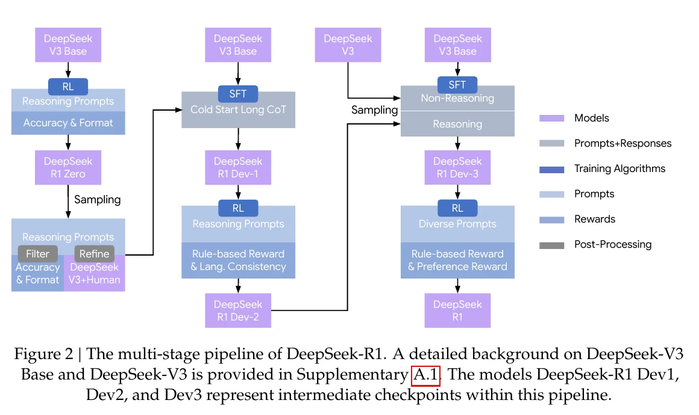

*DeepSeek-R1 exposed a staged recipe: seed useful reasoning, optimize verifiable behavior, recover general capability, then distill the result. Figure 2 from the [DeepSeek-R1 technical report](https://arxiv.org/abs/2501.12948).*

That openness also demystified the interface. A `<think>` block was not a symbolic theorem prover hidden inside the transformer. It was an autoregressively generated scratch space, learned through training and given special treatment by the prompt template and serving stack.

### 2025: reasoning became configurable

Once reasoning was a model behavior, providers began turning it into a family of controls. Qwen3 offered hybrid thinking and non-thinking modes. OpenAI’s gpt-oss encoded low, medium, and high effort in the Harmony prompt protocol. Hosted APIs exposed qualitative levels, numeric budgets, or adaptive modes. Gateways such as OpenRouter normalized the wire format, while hosts such as Baseten surfaced the native semantics of individual open models.[^qwen3][^gpt-oss][^openrouter][^baseten]

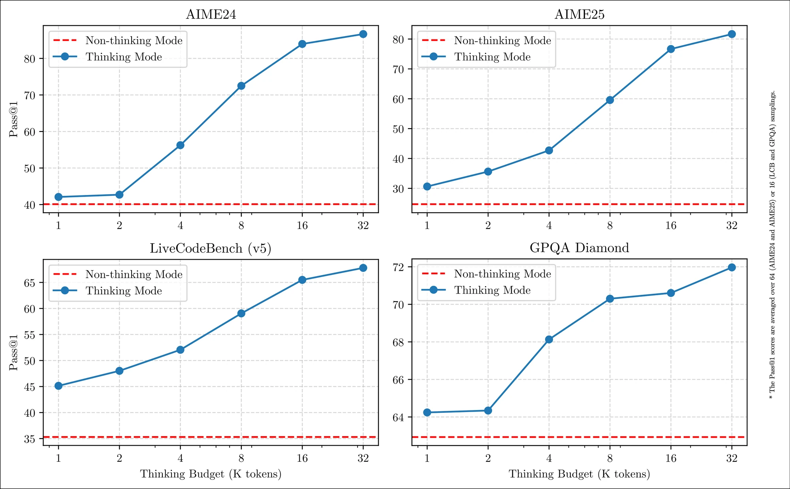

*Qwen3 turned “think more” into something engineers could sweep: a token budget with task-dependent, often diminishing returns. Figure from the [Qwen3 release](https://qwenlm.github.io/blog/qwen3/).*

### 2026: one label, several mechanisms

The current generation has made the term *effort* less uniform, not more. It can mean a learned ordinal mode, a hard token budget, a continuous conditioning value, an adaptive provider policy, preserved thinking across tool calls, or—in one multi-agent API—the number of collaborating agents. Agent harnesses now sit above those mechanisms, allocating compute across planning, acting, verification, retries, and handoffs.

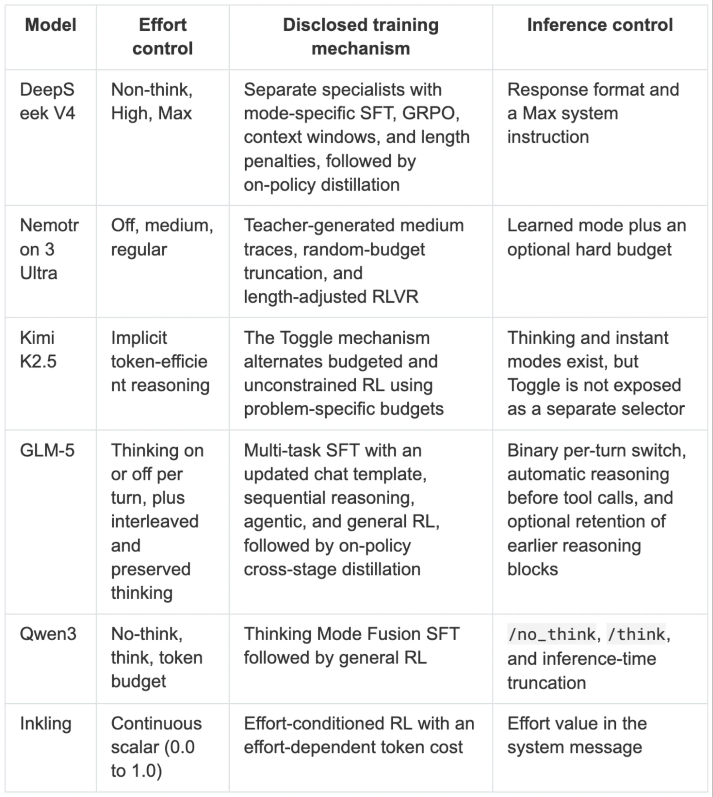

*The shared word “effort” hides very different implementations: discrete specialists, token budgets, binary switches, retained thinking, and continuous conditioning. Comparison from [Sebastian Raschka’s 2026 survey](https://magazine.sebastianraschka.com/p/controlling-reasoning-effort-in-llms).*

### September 2026: effort becomes mutable conversation state

The next step arrived almost quietly. Anthropic documented per-message effort for Claude on 1 September; OpenAI followed with GPT-6 Astra on 3 September. Both let an application append a privileged configuration event that changes effort for later turns without rewriting the conversation that came before it. A control that used to belong near the beginning of a request had become mutable state inside a long-running conversation.[^openai-reasoning][^anthropic-effort][^astra]

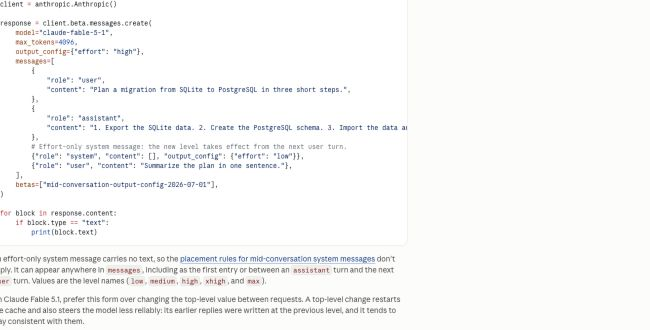

*Claude’s per-message form shows the architectural shift in code: append a privileged effort event, then continue the conversation. Earlier messages remain unchanged and cacheable. Excerpt from [Anthropic’s effort documentation](https://platform.claude.com/docs/en/build-with-claude/effort).*

That history explains the present confusion. The industry converged on the need to control inference-time work, but not on a unit for measuring it. The rest of this article follows the stack downward—from the semantics of the control, through tokens and model training, and back upward into agent policy and production evaluation.

## What reasoning effort actually controls

A conventional description of an LLM request has two parts: tokens go in and tokens come out. A reasoning model adds a meaningful middle stage. Before and sometimes between pieces of visible output, the model can spend computation deciding how to approach the task. It may decompose the problem, keep track of intermediate results, reconsider an assumption, decide which tool to call, or inspect whether a proposed answer is internally consistent.

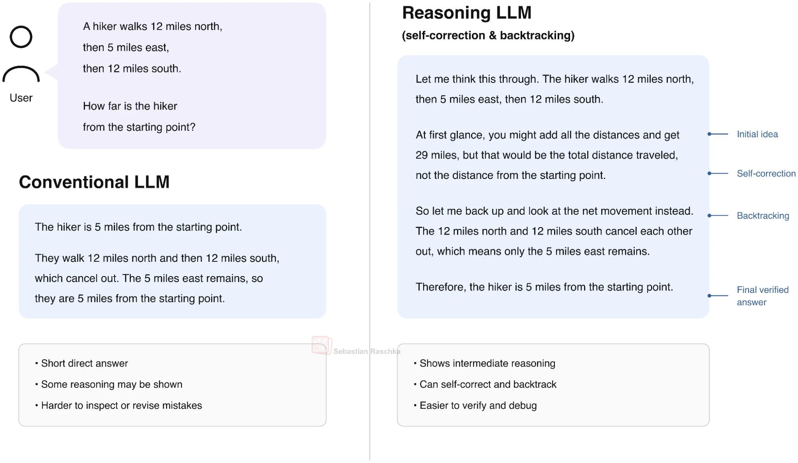

*The same question, two response shapes. The middle stage is where effort is spent — and where self-correction and backtracking happen. From [Sebastian Raschka’s survey](https://magazine.sebastianraschka.com/p/controlling-reasoning-effort-in-llms).*

## Reasoning tokens are part of the budget

Reasoning models introduce a hidden computational stage between input and visible output. Providers account for that work in different ways, but the engineering consequences are the same: it consumes budget, time, and context capacity.

In OpenAI’s Responses API, reasoning tokens are not exposed as readable internal chain-of-thought. They are still counted in usage, occupy context-window space, and are billed as output tokens. The response reports their count under `output_tokens_details.reasoning_tokens`.[^openai-reasoning]

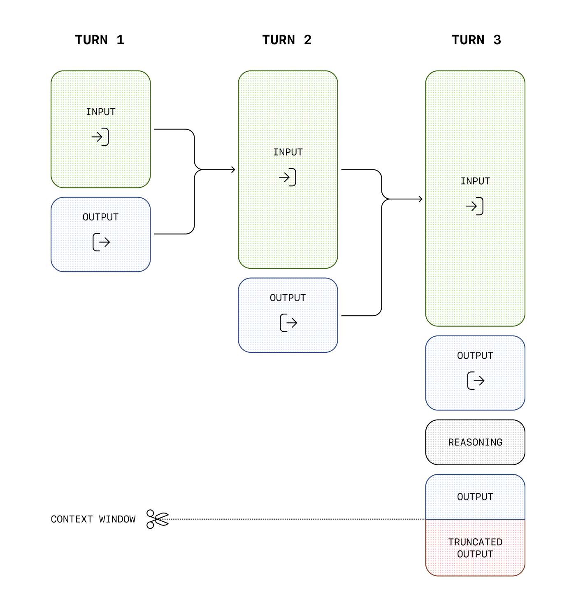

*Reasoning tokens occupy the context window and are billed as output, even though they are discarded between turns. Diagram from [OpenAI’s reasoning guide](https://developers.openai.com/api/docs/guides/reasoning).*

| Token class | Visible? | Consumes budget? |
|---|---:|---:|
| Input tokens | Yes | Yes |
| Reasoning tokens | No* | Yes |
| Visible output | Yes | Yes |

*Some APIs can return a summary, but not the model’s raw private reasoning.

Reasoning effort is usually not a promise to spend an exact number of tokens. It is a policy signal. OpenAI’s documentation describes models as adaptive across effort levels: simple tasks can use fewer tokens, while harder tasks can use more.[^openai-reasoning]

### Budget for the invisible work

A response can exhaust its output limit during reasoning before it emits a useful visible answer. Treat the generated-token limit as a shared envelope, not merely a cap on prose length.

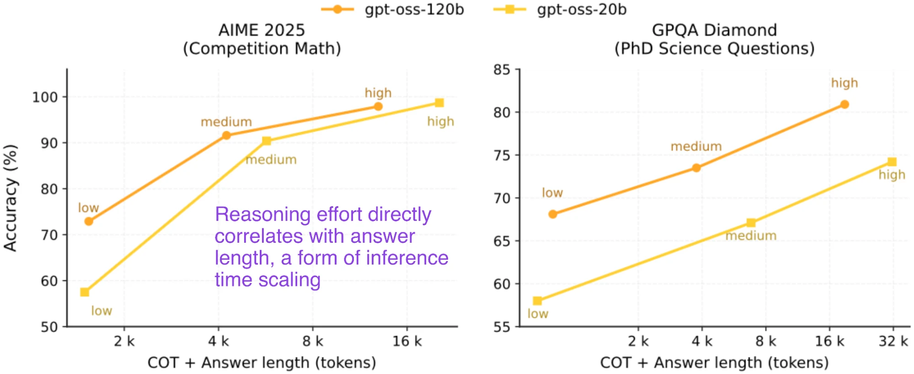

*What the effort levels actually buy on gpt-oss: more tokens generated, and accuracy that follows the token count rather than the label. From [Sebastian Raschka’s survey](https://magazine.sebastianraschka.com/p/controlling-reasoning-effort-in-llms).*

## Reasoning effort is not verbosity

Reasoning effort changes the work used to solve a task. It does not directly set how long, creative, or well-informed the final answer will be.

| Control | Primarily changes | Does not guarantee |
|---|---|---|
| `reasoning.effort` | Internal problem-solving work | A longer or correct answer |
| Verbosity | Detail in the visible response | Deeper analysis |
| Output-token limit | The hard generation ceiling | Efficient use of the ceiling |
| Temperature | Sampling variability | More careful reasoning |
| Context window | Information available in a request | Attention to every detail |

A model can reason extensively and return three sentences. It can also produce two pages of plausible prose after shallow reasoning. This is why “explain in detail” is not a reliable substitute for an effort control—and why visible length is a poor proxy for computational work.

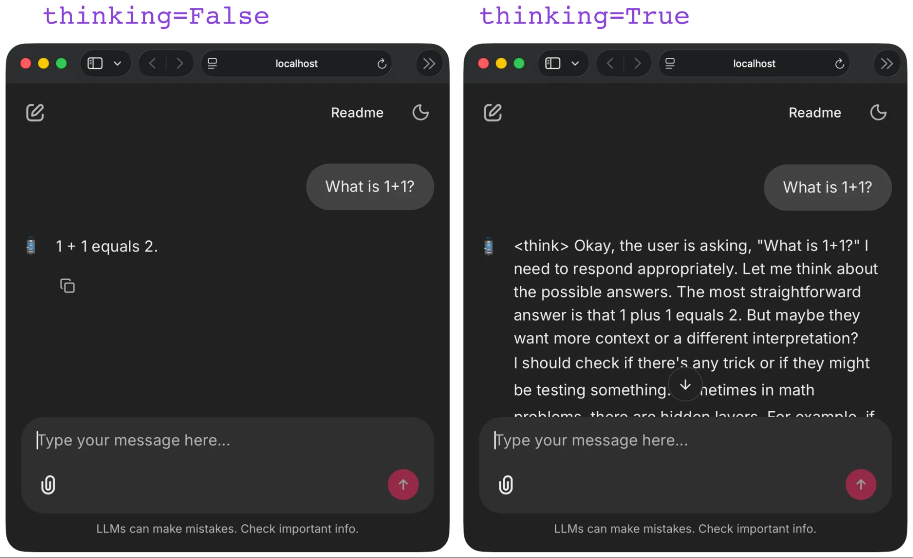

*The same trivial question with thinking off and on. The internal work changed enormously; the answer did not. From [Sebastian Raschka’s survey](https://magazine.sebastianraschka.com/p/controlling-reasoning-effort-in-llms).*

## The API surface

The exact parameter is provider- and model-specific. Some APIs expose qualitative levels, some expose token budgets, and others choose adaptively. Always check the model’s current reference page before hard-coding a value.

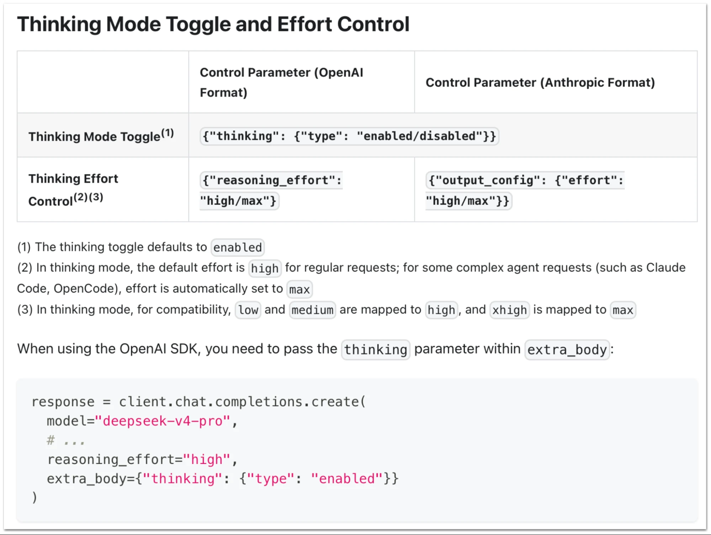

*One model, two wire formats, and a footnote explaining which levels get silently remapped — a compact illustration of why a gateway label is not a portable quantity. From [Sebastian Raschka’s survey](https://magazine.sebastianraschka.com/p/controlling-reasoning-effort-in-llms).*

Here is a concrete OpenAI Responses API example. At the time of writing, `gpt-5.6` supports `none`, `low`, `medium`, `high`, `xhigh`, and `max`; supported values and defaults remain model-dependent.[^openai-models]

```javascript
import OpenAI from "openai";

const client = new OpenAI();

const response = await client.responses.create({
  model: "gpt-5.6",
  reasoning: { effort: "medium" },
  input: "Review this migration plan for data-loss risks.",
  max_output_tokens: 32000
});

console.log(response.output_text);
console.log(
  response.usage.output_tokens_details.reasoning_tokens
);
```

Three details matter:

1. **Effort is guidance.** It influences the model’s reasoning policy rather than reserving a fixed block of tokens.
2. **The limit is shared.** `max_output_tokens` covers reasoning and visible generated output.
3. **Usage is observable.** Record reasoning tokens, total tokens, latency, and outcome quality together.

API behavior changes. Keep examples tied to a dated model reference and verify them against the official documentation before shipping.

### The same idea has several API shapes

| Surface | Primary control | Important behavior |
|---|---|---|
| OpenAI Responses | `reasoning.effort` | Qualitative levels; reasoning tokens share the generated-output envelope. |
| Anthropic Messages | `thinking.type` plus `output_config.effort` | Adaptive thinking decides whether and how deeply to think; effort applies to the whole response. |
| Google Gemini | `thinking_level` | Dynamic thinking is the default on current thinking models; supported levels vary. |
| xAI Responses | `reasoning.effort` | Grok 4.6 uses it for depth; the Grok multi-agent model uses it for agent count. |
| OpenRouter | `reasoning.effort` or `reasoning.max_tokens` | A normalized gateway surface translated to provider-native controls. |
| Baseten Model APIs | Model-specific fields | Open-weight models keep their native chat-template and reasoning semantics. |

> **Current snapshot, 5 September 2026.** OpenAI’s GPT-5.6 family exposes a broad effort ladder and GPT-6 Astra adds cache-preserving mid-conversation updates; recent Claude models combine adaptive thinking with per-message effort; Gemini 3.x uses dynamic thinking levels; Grok 4.6 adds `xhigh`; and recent open-weight/API releases include DeepSeek V4, Qwen3.8, Kimi K3, GLM-5.3 and GLM-5.3-Flash, Nemotron 3 Ultra, gpt-oss, and Inkling. Capability discovery should be part of the client, not a hard-coded assumption.[^openai-reasoning][^openai-models][^anthropic-thinking][^anthropic-effort][^gemini][^xai][^qwen38]

Anthropic separates the thinking mode from response-wide effort. On a model that supports adaptive thinking:

```python
response = client.messages.create(
    model="claude-opus-4-8",
    max_tokens=16000,
    thinking={"type": "adaptive"},
    output_config={"effort": "medium"},
    messages=[{"role": "user", "content": prompt}],
)
```

Older extended-thinking Claude models use `budget_tokens` instead. The two forms are model-generation specific and should not be treated as interchangeable.[^anthropic-thinking][^anthropic-effort]

xAI’s API illustrates why field names alone are insufficient. For Grok 4.6, `reasoning.effort` selects low, medium, high, or xhigh depth and reasoning cannot be disabled. On `grok-4.20-multi-agent`, the same field controls how many agents collaborate instead of the depth of one trajectory.[^xai]

OpenRouter presents a normalized request:

```json
{
  "model": "your-model",
  "messages": [{"role": "user", "content": "..."}],
  "reasoning": {"effort": "high"}
}
```

The gateway maps that value to a provider level or a token budget. This is useful portability, not standardization: `medium` can mean different policies after translation.[^openrouter]

Baseten serves open-weight models through an OpenAI-compatible endpoint while retaining model-native controls. Its DeepSeek V3.2 example enables thinking through the chat template:

```python
response = client.chat.completions.create(
    model="deepseek-ai/DeepSeek-V3.2",
    messages=[{"role": "user", "content": prompt}],
    extra_body={"chat_template_args": {"enable_thinking": True}},
)
```

That is a model-specific switch, not a portable effort ladder.[^baseten]

Across providers, log the application’s intended effort, the exact native request, observed usage, and the model version. Otherwise a gateway or model migration can silently change the meaning of an experiment.

## Inside open-weight reasoning models

In the common open-weight design, “thinking” is not a separate symbolic engine. The model autoregressively generates an intermediate sequence—often in a dedicated channel or between special tags—and generates the answer conditioned on that sequence. More effort usually permits or encourages a longer trajectory; it does not change the transformer into a different algorithm for every token.

There are two engineering problems. Training must teach the model that useful intermediate work improves the eventual answer. Serving must format the request, parse the channels, manage budgets, and preserve the required reasoning state across turns.

### Training scaling and inference scaling

Training a larger or better post-trained model changes the weights. Increasing reasoning effort keeps the weights fixed and spends more compute during generation. Model capacity and inference budget are separate axes. A smaller model at high effort can sometimes match a larger model at low effort, but the relationship is workload-specific.

A longer trace is only one form of inference scaling. A harness can sample multiple solutions and select by majority vote or a verifier, ask for critique and revision, search a tree of candidates, or fan out to several agents. These methods spend compute across trajectories instead of only extending one.

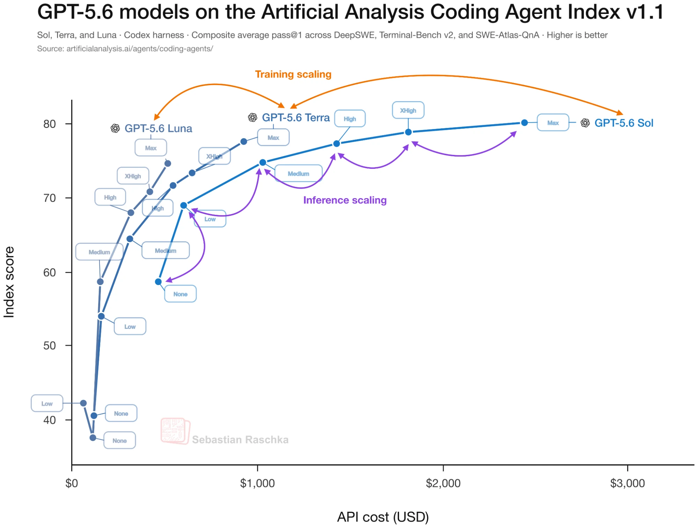

*Two different arrows on one chart: training scaling moves between checkpoints, inference scaling moves along a checkpoint’s own effort ladder. From [Sebastian Raschka’s survey](https://magazine.sebastianraschka.com/p/controlling-reasoning-effort-in-llms).*

### RLVR and think delimiters

DeepSeek-R1 popularized reinforcement learning with verifiable rewards. In math or code, a checker can reward the final answer without supervising every reasoning step. The model can learn scratch work, backtracking, and self-correction because those behaviors improve its chance of receiving the outcome reward.[^deepseek-r1]

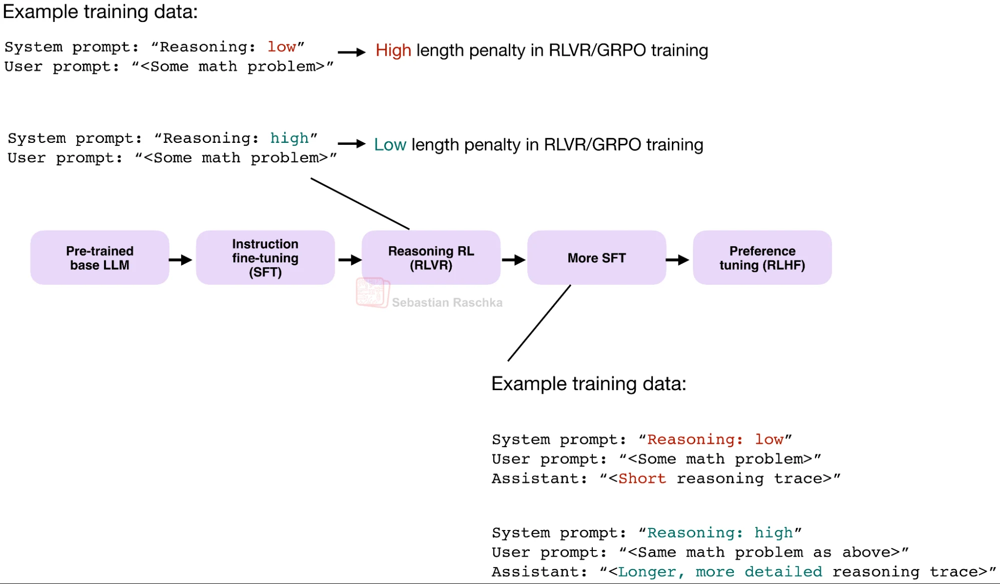

*How a model is taught to read the word “low”: the requested effort goes in the system prompt while the length penalty moves in the opposite direction during RL. From [Sebastian Raschka’s survey](https://magazine.sebastianraschka.com/p/controlling-reasoning-effort-in-llms).*

The literal `<think>` tags do not create reasoning. They delimit an intermediate trace so trainers, servers, and user interfaces can separate it from the answer. Another marker could serve the same protocol role.

Current reports disclose four recurring mechanisms for controllable effort:

1. Mixed supervised fine-tuning on direct and reasoning examples conditioned on a mode.
2. Mode-conditioned reinforcement learning with different token costs, length penalties, or budgets.
3. Separate domain or effort specialists distilled into a single controllable checkpoint.
4. Budget-aware training or serving that teaches the model to answer after a reasoning trace is truncated.

A plain-language instruction works only when post-training taught the model to interpret it. Adding “reason at maximum effort” to an arbitrary model does not manufacture a calibrated mode.

### DeepSeek-R1

DeepSeek-R1-Zero applied large-scale reinforcement learning without supervised fine-tuning first and exhibited longer reasoning, reflection, and self-correction. The full R1 pipeline added cold-start supervised data, further reinforcement learning, and later supervised and RL stages. DeepSeek also distilled the behavior into smaller Qwen and Llama checkpoints.[^deepseek-r1]

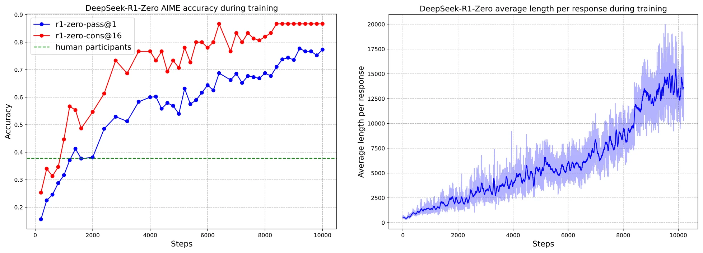

*Nobody asked R1-Zero for longer traces. Reward for being right, and the response length climbs on its own. Figure 1 from the [DeepSeek-R1 technical report](https://arxiv.org/abs/2501.12948)*

### Qwen3

Qwen3 was trained for hybrid thinking and non-thinking behavior. Its Transformers integration enables thinking by default, supports a hard `enable_thinking=False` switch, and accepts `/think` or `/no_think` steering when thinking is enabled. The template and parser separate the generated trace from the final answer. Qwen3 also supports a hard reasoning budget: the runtime can stop the trace, insert a stop-thinking instruction, and continue to the answer. Its report says this continuation behavior emerged after Thinking Mode Fusion rather than explicit truncation training.[^qwen3]

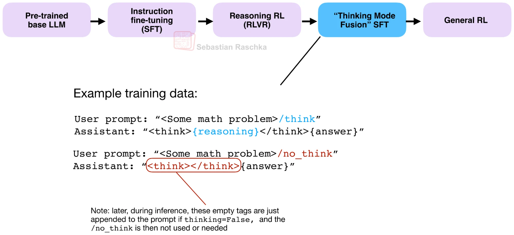

*Qwen3’s hybrid switch is a training artifact: the same checkpoint is fine-tuned on both `/think` and `/no_think` examples, empty thinking tags included. From [Sebastian Raschka’s survey](https://magazine.sebastianraschka.com/p/controlling-reasoning-effort-in-llms).*

### gpt-oss

OpenAI’s gpt-oss models are open-weight mixture-of-experts reasoning models with low, medium, and high effort. The Harmony prompt protocol places effort in the system message and separates analysis, tool commentary, and final channels. A serving runtime may implement Harmony for you; a custom loop must render and parse it correctly.[^gpt-oss]

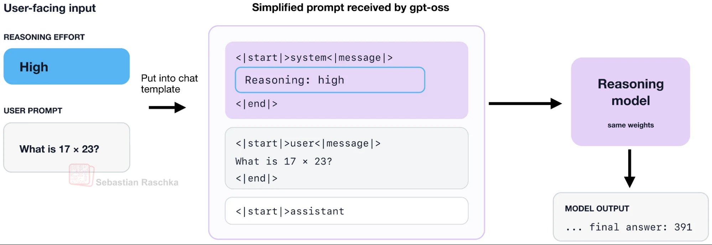

*Where the effort selector actually lands in gpt-oss: as the line `Reasoning: high` inside the opening Harmony system message. From [Sebastian Raschka’s survey](https://magazine.sebastianraschka.com/p/controlling-reasoning-effort-in-llms).*

### The 2026 generation

| Model | Inference control | Distinctive mechanism |
|---|---|---|
| DeepSeek V4 | Non-think plus low, high, max | Effort changes the prompt prefix and selects behavior created during post-training. |
| Nemotron 3 Ultra | Learned reasoning mode plus external token budget | Budget-aware continuation allows the server to close a reasoning span near a limit. |
| Kimi K2.5 | Thinking or instant mode | Token-Efficient RL alternates budgeted and unconstrained phases so efficiency does not destroy test-time scalability. |
| Kimi K3 | Low, high, max | Domain × effort specialists are combined through multi-teacher on-policy distillation. |
| Qwen3.8 | Explicit effort plus thinking on/off | Preserved thinking lets earlier reasoning state participate in long tool-using conversations. |
| GLM-5.3 | Low, high, max; always thinking | Builds on interleaved, preserved, and per-turn thinking for tool-using runs. |
| Inkling | Continuous value | The system-message effort changes per-token cost during large-scale RL. |

DeepSeek V4’s current API accepts low, high, and max effort, while non-thinking is separate. The released encoder shows that the effort mode changes a text prefix before the system message. A gateway translating `medium` must therefore choose and document a mapping.[^deepseek-v4]

Nemotron 3 Ultra combines controllable reasoning budgets with supervised fine-tuning, reinforcement learning, and multi-teacher on-policy distillation. Its budget-aware pattern lets a client stop a trace near a threshold and still ask the model to complete the answer.[^nemotron]

Kimi K2.5’s Toggle method alternates budgeted training phases, where correct solutions are encouraged to stay under a problem-specific limit, with unconstrained phases that restore the normal generation ceiling. The released policy has no selector for these training phases; the method makes its default thinking policy more token-efficient without removing its ability to benefit from extra test-time compute.[^kimi-k25]

Kimi K3 trains specialists across general, coding, and agentic domains at multiple effort budgets, then combines them into one model. Its API requires complete reasoning content to be preserved across multi-turn tool use.[^kimi-k3]

Qwen3.8 extends Qwen’s hybrid modes with explicit effort control and preserved thinking history. Retaining earlier reasoning can improve continuity and cache reuse, but the harness and inference runtime must agree on the chat-template contract.[^qwen38]

GLM introduced interleaved thinking between tools, preserved thinking across turns, and per-turn toggles. The August 2026 GLM-5.3 release adds low, high, and max effort and removes the thinking-off mode; GLM-5.3-Flash followed with the same effort-oriented evaluation framing.[^glm][^glm-flash]

Thinking Machines Lab’s Inkling uses a continuous effort value. During large-scale asynchronous RL, effort appears in the system message and changes the cost assigned to generated tokens, directly conditioning the cost–quality trade-off.[^inkling]

## Why not choose effort automatically?

Providers can, and increasingly do. Gemini uses dynamic thinking by default on current thinking models. Anthropic’s adaptive mode decides whether and how deeply to think. OpenAI treats effort as guidance rather than an exact reservation.[^gemini][^anthropic-thinking][^openai-reasoning]

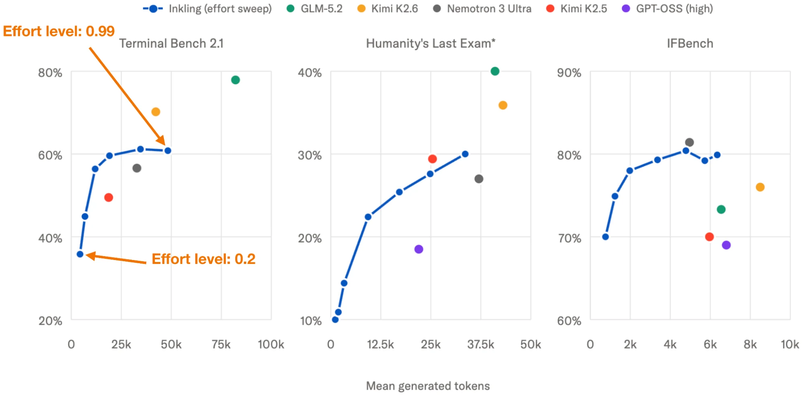

*A continuous effort sweep instead of three labels: one checkpoint traced from effort 0.2 to 0.99 against fixed points for other models. From [Sebastian Raschka’s survey](https://magazine.sebastianraschka.com/p/controlling-reasoning-effort-in-llms).*

That does not solve the application’s optimization problem. The provider may not know the cost of a wrong migration recommendation, a user’s latency target, whether a validator can catch a bad extraction, or whether the next tool call is irreversible. Prompt difficulty is only one input. The real question is how much this system should spend given the value and risk of the step.

The useful division of responsibility is hierarchical:

1. The application chooses an envelope: model, maximum effort, token budget, deadline, and escalation policy.
2. The provider or model adapts inside that envelope to the prompt.
3. The harness observes the result and accepts, retries, escalates, or requests human review.

## The role of the agent harness

An agent harness owns the loop around model calls: state, tools, retries, handoffs, limits, and observability. Reasoning effort can therefore change per call as a run moves through classification, planning, action, verification, and synthesis.

A harness can:

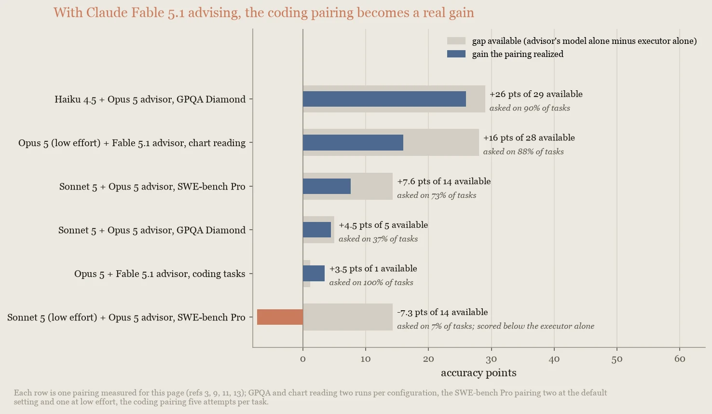

*One harness-level move, measured: keep a cheap model in the loop and call a stronger one on demand rather than raising effort everywhere. From Anthropic’s [“Optimizing for cost and intelligence”](https://platform.claude.com/docs/en/about-claude/models/optimizing-for-cost-and-intelligence).*

- Set different effort for different steps.
- Switch to a stronger model when more effort on the current model is unlikely to help.
- Start cheaply and escalate after a validation failure.
- Enforce token, call, tool, wall-clock, and spend budgets over the complete run.
- Preserve provider-specific reasoning items or signed thinking blocks across turns.
- Attribute usage and quality to the policy that caused each call.

The OpenAI Agents SDK accepts reasoning settings at agent or run level and aggregates reasoning-token usage. LangChain middleware can intercept each model call and dynamically replace the model or configuration from current state.[^openai-agents][^langchain-agents]

```javascript
function policy(step, state) {
  if (state.deadlineMs < 1200) return { model: "fast", effort: "low" };
  if (step.kind === "classify") return { model: "fast", effort: "low" };
  if (state.validatorFailures > 0) return { model: "strong", effort: "high" };
  if (step.isIrreversible) return { model: "strong", effort: "high" };
  return { model: "default", effort: "medium" };
}
```

Planning and acting often deserve different budgets. A research agent might reason deeply about a search plan, spend little on independent queries, and raise effort again to reconcile evidence. A coding agent might spend more on architecture and review than on mechanical edits guarded by tests.

Reasoning state is also protocol data. Providers may return summaries, encrypted items, signed blocks, or plain reasoning text, with different continuation rules. A harness should preserve required structures without copying private reasoning into user-visible text or indiscriminate logs.

## When changing effort stops breaking the cache

Per-step effort sounds economical until the conversation becomes long. Many model protocols serialize effort near the beginning of the prompt. Changing `low` to `high` then changes an early token, so the previously cached prefix no longer matches. The harness saves reasoning tokens on one turn and pays to process the entire history again on the next.

GPT-6 Astra and recent Claude models change that trade-off. They let the application append an effort update to an existing conversation. The old history remains byte-for-byte unchanged and eligible for prompt-cache reuse; only the new control event and later turns have to be processed under the new policy. Qwen3 offered an earlier, less formal open-weight analogue, while Gemini can preserve the economics of a stable cached corpus without making the same arbitrary-conversation guarantee.

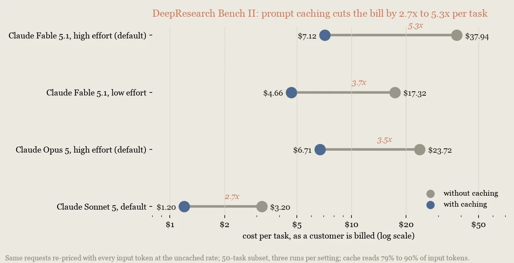

*Why the prefix is worth protecting: on a repeated-prefix workload, caching moves the bill by multiples, not percentages. From Anthropic’s [“Optimizing for cost and intelligence”](https://platform.claude.com/docs/en/about-claude/models/optimizing-for-cost-and-intelligence).*

> **Thesis:** Reasoning effort is becoming mutable runtime state. The important shift is from rebuilding a prompt to appending a privileged event.

### A strict definition

A model qualifies here only when all four technical conditions hold:

1. A conversation already has a cacheable prefix.
2. Effort can change for a later turn.
3. The earlier serialized prefix is not rewritten.
4. The serving API or runtime can reuse that prefix computation.

A provider-documented guarantee makes the claim *exact*. Merely supporting prompt caching and an effort parameter is not enough.

### Why one early change invalidates everything after it

A causal transformer computes each token from all the tokens before it. If effort is encoded at the front of the sequence, changing the setting changes the input to every later cached state:

```text
# Cache-breaking
[effort=low]  [system] [turn 1] [turn 2] ...
[effort=high] [system] [turn 1] [turn 2] ...

# Cache-preserving
[system] [turn 1] [turn 2]
[privileged control: effort=high] [turn 3]
```

If every turn adds roughly Δ tokens and the full history is prefetched again, the processed prefix grows like Δ(1 + 2 + … + n): roughly quadratic in the number of turns. Reusing unchanged prefixes moves the newly prefetched text toward O(nΔ). This reduces time to first token, input processing, and accelerator work. It does not remove the cost of decoding new reasoning or visible output, and actual savings still depend on cache retention, routing, and provider pricing.[^anthropic-cost][^vllm-cache]

### The exact implementations: Astra and Claude

GPT-6 Astra adds a `configuration_update` item to the Responses API. The update applies to the next user turn, persists until another update, and currently changes reasoning effort only. OpenAI documents that the existing prompt prefix remains cached. The feature is limited to Astra's standard single-agent configuration; adjacent update items are rejected; and it is not directly compatible with automatic compaction, automatic truncation, or a standalone compact request. After an explicit compaction trigger, the application must reapply the desired effort.[^openai-reasoning][^astra]

```json
{
  "type": "configuration_update",
  "reasoning": { "effort": "high" }
}
```

**Astra observability footgun:** response metadata can report the request-level effort rather than the effective effort established by an in-history update. Log the update event and the effective state computed by the harness; do not reconstruct it from one response field.[^openai-reasoning]

Claude Fable 5.1, Mythos 5.1, and Opus 5 use a similar idea through an appended empty system message containing `output_config.effort`. With the `mid-conversation-output-config-2026-07-01` beta header, the change starts with the next user turn, persists until overridden, and leaves earlier messages unchanged. Anthropic explicitly warns that changing the traditional top-level effort parameter still restarts the cache. The beta header's date is a protocol identifier, not a release date; public release notes announced per-message effort on 1 September 2026.[^anthropic-effort][^anthropic-releases]

```json
{
  "role": "system",
  "content": [],
  "output_config": { "effort": "high" }
}
```

Claude's direction is broader than effort: Anthropic also supports mid-conversation changes to system instructions and tool definitions. That makes this pattern especially relevant to long-running agents whose execution policy changes while their semantic history should remain stable.[^anthropic-releases]

### Current landscape

| Model | Where effort is encoded | Across-change cache status | Classification |
|---|---|---|---|
| GPT-6 Astra | Appended `configuration_update` | Provider-documented | Exact |
| Claude Fable 5.1, Mythos 5.1, Opus 5 | Appended system event with `output_config.effort` | Provider-documented beta | Exact |
| Qwen3 | Latest message can contain `/think` or `/no_think` | Possible with runtime prefix caching | Open-weight analogue |
| Gemini | Per-request thinking plus named cached content | Stable cached base is reusable; arbitrary dialogue transition is not guaranteed | Economic near-equivalent |
| Grok 4.6 | Top-level effort plus automatic prefix caching | Not documented across an effort change | Unconfirmed |
| Kimi K3 | Top-level effort selected for the conversation | No documented mid-conversation transition | Not equivalent |
| DeepSeek V4 | Effort prefix before the system message | Early tokens change | Cache-breaking |
| GLM-5.3 | Instruction in the initial system/control prefix | Early tokens change | Cache-breaking |
| Mistral Small 4 | Early `MODEL_SETTINGS` block | Early tokens change | Cache-breaking |
| Qwen3.8 | Graded effort becomes an initial system instruction | Early tokens change | Cache-breaking |
| gpt-oss | Opening Harmony system message | Early tokens change | Cache-breaking |
| MiniMax M3 | Thinking instruction in the initial system prompt | Early tokens change | Cache-breaking |

This snapshot covers the principal families investigated on 5 September 2026; it is not exhaustive. “Cache-breaking” describes the official serialization template, not an intrinsic limit of the weights.[^gpt-oss][^deepseek-v4][^kimi-k3][^xai][^qwen38][^qwen38-template][^glm-template][^mistral-template][^minimax-template][^xai-cache]

### Qwen3 and Gemini show the boundary

The original Qwen3 follows the most recent `/think` or `/no_think` instruction, so a new user or system message can switch modes while prior tokens remain identical. A runtime such as vLLM can reuse matching prefix blocks. This is a real precursor, but a weaker contract: the control is binary, textual rather than privileged, vulnerable to imitation by user or retrieved content, and dependent on stable serialization, routing, eviction, and runtime configuration. There is no hosted guarantee equivalent to Astra's.[^qwen3][^vllm-cache]

Qwen3.8 illustrates the trade-off in the other direction. Its template turns graded effort into an instruction in the first system block. The control is finer, but changing it rewrites the start of the sequence and loses prefix composability.[^qwen38][^qwen38-template]

Gemini separates a request's thinking level from an explicitly named cached-content object. An application can cache a large system prompt or document corpus, reference it repeatedly, and vary thinking per request. That preserves the economic value of stable RAG context, but Google does not promise that a changed thinking level preserves an arbitrary accumulated dialogue cache. Treat it as a near-equivalent and verify hits with `usage.total_cached_tokens` rather than inferring them from request structure.[^gemini][^gemini-cache]

### What changes for an agent harness

Cache-preserving transitions make adaptive effort practical at the step level. A harness can use low effort for extraction, routing, formatting, and routine tool calls; medium for normal execution; high for planning and ambiguous decisions; and the deepest level for recovery, consequential actions, or final review—without turning every policy change into a full-prefix miss.

The optimization unit is no longer just the model. It is the model plus prompt protocol, controller, cache implementation, and compaction strategy. Two applications using the same weights can have very different latency and cost because one maintains an immutable prefix while the other rewrites system instructions, tools, or effort on every turn.

Typed privileged controls are safer than textual switches such as `/think`: they are harder for users or retrieved documents to spoof, easier to validate and audit, and clearer training targets. This suggests an *append-only inference control plane* in which a harness can record events such as effort changes, tool grants, permission revocations, response verbosity, or deadlines without rewriting semantic history. That is an architectural inference from current APIs—not a provider-announced roadmap.

### The unresolved problem is compaction

An append-only history eventually becomes too large. Compaction then rewrites the prefix and may erase the events that established current policy. A complete checkpoint has to preserve both summarized semantic history and effective runtime state: reasoning effort, active tools, permissions, output configuration, and outstanding agent state. Astra's current compaction restrictions expose the protocol gap directly. Future agent APIs will likely need explicit snapshots that combine compressed history with a typed configuration checkpoint.

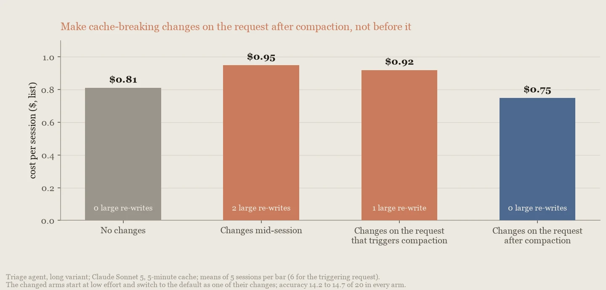

*Until the protocol gap closes, timing is the lever: make a cache-breaking change on the request after compaction, not before it. From Anthropic’s [“Optimizing for cost and intelligence”](https://platform.claude.com/docs/en/about-claude/models/optimizing-for-cost-and-intelligence).*

Until then, a production harness should keep stable instructions and long-lived context first; append rather than rewrite; record cache reads, writes, and uncached tokens; track effective effort independently of response metadata; reapply state after compaction; and pin effort for a session when the model template encodes it at the beginning. Escalation is also forward-only: raising effort now cannot retroactively repair a bad decision already embedded in the history.

## Choosing an effort level

Start with the lowest effort that reliably clears your quality bar. Increase it when the task has branching possibilities, dependent steps, ambiguity, or costly mistakes.

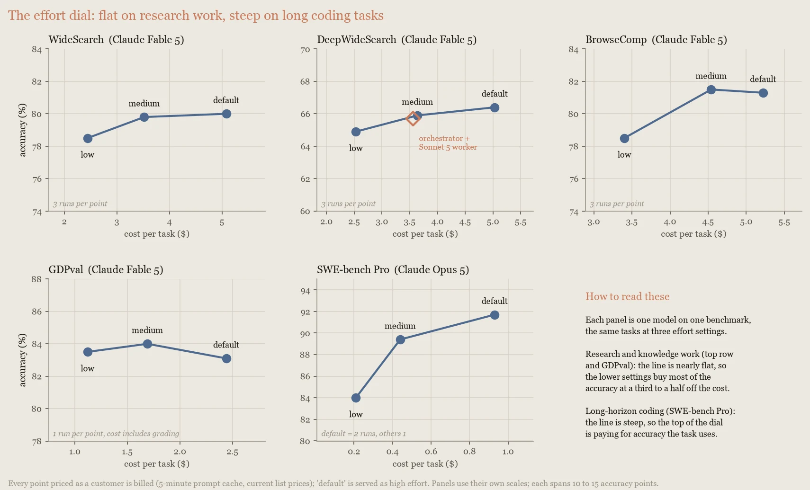

*The same dial, five workloads. It is nearly flat on research tasks and steep on long-horizon coding — which is the whole argument for sweeping it per task family. From Anthropic’s [“Optimizing for cost and intelligence”](https://platform.claude.com/docs/en/about-claude/models/optimizing-for-cost-and-intelligence).*

### None or minimal: direct transformation

Suitable for classification, extraction, formatting, routing, and fast retrieval that do not benefit from chained reasoning.

### Low: light judgment

Useful for short explanations, straightforward tool use, and familiar code changes with one likely solution path.

### Medium: balanced default

A good starting point for planning, debugging, multi-step work, and decisions with several constraints.

### High: hard reasoning

Consider it for complex debugging, architecture, adversarial review, and high-value analysis where missed details matter more than latency.

### Xhigh or max: quality-first runs

Reserve the deepest settings for asynchronous research or difficult agentic work—and only when evaluations justify the additional resources.

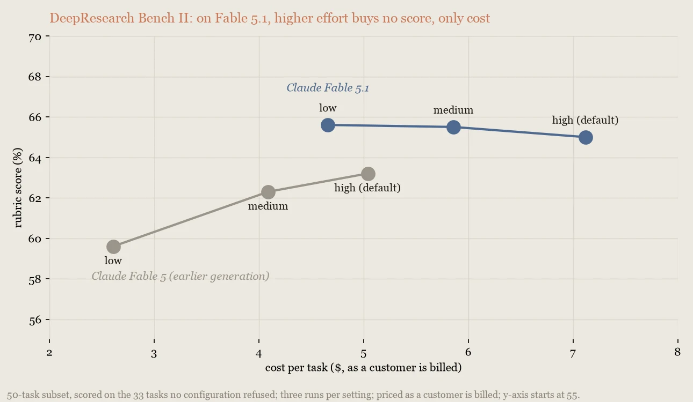

*A measured case of the ceiling: on research work the score flattens above medium while the bill keeps climbing. From Anthropic’s [“Optimizing for cost and intelligence”](https://platform.claude.com/docs/en/about-claude/models/optimizing-for-cost-and-intelligence).*

### A five-question routing test

1. Does the task require several dependent decisions?
2. Are there multiple plausible approaches worth comparing?
3. Would a subtle mistake be expensive or difficult to detect?
4. Can the user tolerate additional latency?
5. Do evaluations show that extra effort improves the outcome?

The first three questions estimate potential value. The fourth establishes the operational budget. The fifth decides the matter. If the evaluation says “no,” the higher setting is overhead.

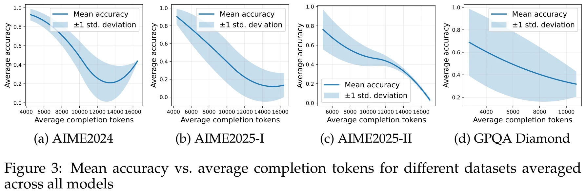

*Difficulty shows up in the tokens a model spends, not in the tokens you send it: accuracy falls as completion length rises across every dataset. Figure 3 from [Agarwal et al.](https://arxiv.org/abs/2512.02008)*

## Evaluate a frontier, not a winner

There is no globally best effort level. You are looking for the configurations that sit on the quality–latency–cost frontier for your workload.

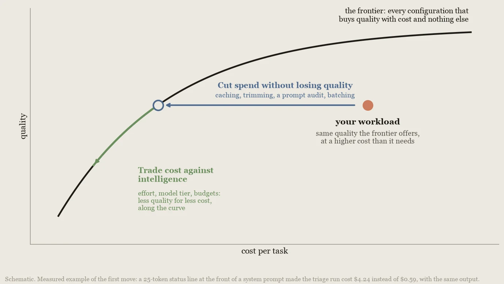

*The shape the whole exercise is looking for: a curve of configurations that buy quality with cost and nothing else. From Anthropic’s [“Optimizing for cost and intelligence”](https://platform.claude.com/docs/en/about-claude/models/optimizing-for-cost-and-intelligence).*

### What published work already shows

The most influential independent result is Snell and colleagues’ ICLR 2025 study of test-time compute. Using mathematical reasoning tasks, revision models, and process reward models, the authors found that the useful strategy depended on problem difficulty. Their adaptive, compute-optimal policy reached the performance of a best-of-*N* baseline with up to four times less inference compute. In a FLOPs-matched comparison, a smaller model with test-time compute could beat a model with fourteen times as many parameters on problems where the smaller model already had a non-trivial chance of success. On the hardest problems, however, additional inference produced little benefit; more capable weights remained the better investment.[^snell]

The peer-reviewed *s1* project provides a concrete implementation case. The researchers fine-tuned Qwen2.5-32B-Instruct on 1,000 carefully selected reasoning examples, then controlled its inference budget by ending the reasoning span at a limit or appending “Wait” when the model tried to stop. On AIME 2024, extending the budget raised reported accuracy from 50% to 57%. The case is important because the data, model, and code are open, but its result should not be universalized: the model was specifically trained for the intervention and the headline evaluations were competition mathematics and science questions.[^s1]

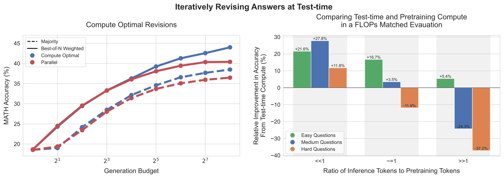

*The result and its boundary in one figure: compute-optimal allocation beats best-of-*N* at the same budget (left), but on hard questions extra pretraining still wins (right). Figure 1 from [Snell et al.](https://arxiv.org/abs/2408.03314)*

A later large-scale study generated more than 30 billion tokens with eight open models across four reasoning datasets. It found no universally best test-time strategy. Some models favored short traces; others benefited from longer traces only on hard problems; expanding beam search often flattened or reduced accuracy even while consuming more tokens. The best policy depended on the model’s post-training, the problem, and the available compute budget.[^art-tts]

### A published harness case: retry only the failures

Anthropic reported a directly operational experiment on an internal subset of SWE-bench Pro. Running Claude Opus 5 at low effort first, then rerunning only the test-detected failures at the default effort, achieved about a 93% pass rate for roughly $0.70 per task. Running every task once at the default achieved 91.7% for $1.39 per task. Starting at medium and rerunning failures produced about 94% for $0.95.[^anthropic-cost]

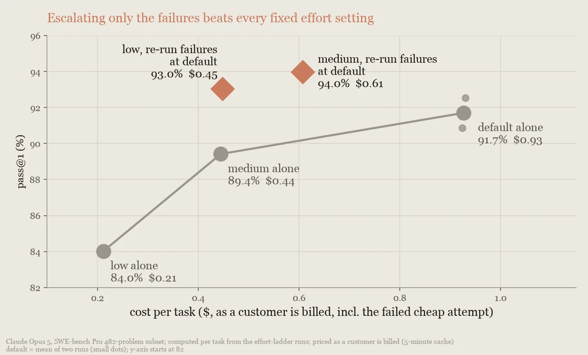

*The published numbers plotted: both retry strategies sit above and to the left of every fixed setting, including the default. From Anthropic’s [“Optimizing for cost and intelligence”](https://platform.claude.com/docs/en/about-claude/models/optimizing-for-cost-and-intelligence).*

The result is a useful case study of what an agent harness contributes: the model adapts within one call, but the harness observes an external test result and reallocates budget across calls. It also exposes the boundary conditions. The measurement was vendor-run on a private subset and is not comparable to the public SWE-bench leaderboard. It works because tests provide a reliable failure signal, and failed tasks pay for two attempts and therefore take longer.

> **Read the numbers as evidence for a pattern, not as portable pricing.** The independent studies use mathematical and scientific tasks; the harness example uses checkable code tasks and vendor models. Together they support adaptive allocation, but they do not establish one universal effort level.

### What these results establish

1. Additional inference compute can improve accuracy when the model has a viable solution path.
2. The way compute is spent—longer trace, revisions, parallel samples, verifier, or retry—matters as much as the amount.
3. The hardest tasks may need a stronger model rather than more effort on a weaker one.
4. When outcomes are cheaply verifiable, low-first escalation can beat any fixed setting on cost per successful task.

These findings are enough to reject “always high” and “always low” as general policies. They cannot choose a default for every unseen workload, but they give an engineer a defensible prior: allocate effort adaptively, use external verification when it is trustworthy, and measure success at the level of the complete task rather than one model call.

## Routing effort in production

Once the evaluation reveals different sweet spots, stop sending every request through one global setting. Route by observable task properties.

```javascript
function chooseEffort(task) {
  if (task.kind === "extract" && task.schemaIsStrict) {
    return "low";
  }

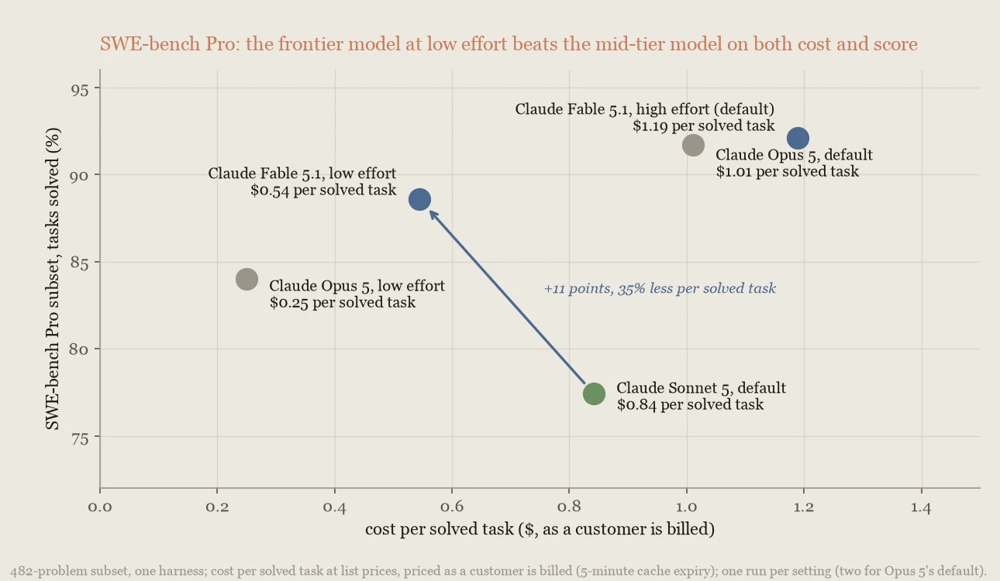

*A routing result worth internalising: the frontier model at low effort can beat the mid-tier model at its default on both cost and score. From Anthropic’s [“Optimizing for cost and intelligence”](https://platform.claude.com/docs/en/about-claude/models/optimizing-for-cost-and-intelligence).*

  if (task.isHighStakes || task.hasManyConstraints) {
    return task.canRunAsync ? "high" : "medium";
  }

  return "medium";
}
```

A router can use request type, number of constraints, tool plan, user tier, latency budget, or an inexpensive difficulty classifier. Keep the decision explainable and log the chosen level. Otherwise, effort becomes an invisible variable in incident analysis.

Three useful patterns:

1. **Start low, escalate on evidence.** Retry at a higher effort only after a validator detects a concrete failure.
2. **Split planning from execution.** Use more effort to form a plan, then less effort for repetitive, constrained steps.
3. **Reserve deep runs.** Move xhigh or max work to asynchronous paths with explicit budgets and timeouts.

### Production guardrails

- Pin a model version while running comparisons.
- Set generated-token and wall-clock limits.
- Handle incomplete responses before showing output.
- Record the model, effort, usage, latency, and validator result.
- Preserve append-only prefixes when the protocol permits, and record cached and uncached input separately.
- Reapply effective effort, tools, and permissions after compaction.
- Re-run evaluations after model, prompt, tool, or schema changes.

## The mistakes that look reasonable

### Defaulting everything to high

Routine work absorbs extra latency and cost while difficult work still lacks task-specific evaluation.

### Using answer length as a quality metric

Long responses can be shallow. Grade correctness, coverage, evidence, and downstream success.

### Changing prompt and effort together

You lose causal information. Sweep one variable at a time before testing interactions.

### Ignoring the missing answer

Reasoning can consume the output envelope. Detect incomplete states and budget generated tokens deliberately.

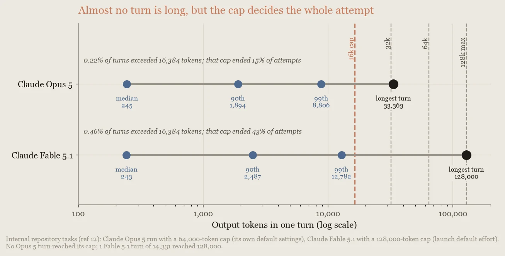

*Almost no turn is long — and the cap still decides the whole attempt, because the few long ones are the ones that were solving something. From Anthropic’s [“Optimizing for cost and intelligence”](https://platform.claude.com/docs/en/about-claude/models/optimizing-for-cost-and-intelligence).*

### Treating labels as portable

“Medium” on one model is not a standardized quantity. Recalibrate when the model or provider changes.

## What comes next: from slider to allocator

*These are dated, falsifiable bets—not a summary of announced product roadmaps. They should be revisited by the end of 2028.*

The reasoning-effort slider is useful today because the underlying systems are still uneven. Over time, the slider is likely to become less important as a user-interface choice and more important as a policy boundary. The user or application will state the goal, risk tolerance, deadline, and spend limit; a provider and agent harness will decide how to distribute that budget.

### Bet 1 — by the end of 2027, effort moves to the step level

A single effort value for an entire agent run is too coarse. Classification, planning, a reversible tool call, an irreversible action, and final verification have different stakes. Harnesses already vary models and settings per call. The next step is a controller that learns where an additional unit of compute has the highest expected value, while explicit rules cap spend and protect high-risk actions.

### Bet 2 — gateways standardize intent before they standardize units

Providers are unlikely to agree on a literal unit of reasoning. Their mechanisms are too different: one extends a single trace, another sets a token ceiling, another fans out agents. A more durable cross-provider contract would express an application intent such as *latency-first*, *balanced*, *quality-first*, or *maximum cost*, then record the native policy used to satisfy it. Gateways can translate the intent, but evaluations must decide whether the translation is acceptable.

### Bet 3 — by 2028, agents gain an append-only control plane

Astra's configuration updates and Claude's per-message configuration make one future concrete: execution policy becomes typed, privileged conversation state. Effort is an early case. Tool availability, permissions, safety and approval modes, verbosity, schemas, latency budgets, retrieval policy, and subagent limits can follow the same append-only pattern. The hard part will be checkpointing that effective state when history is compacted, replayed, or moved between providers.

### Bet 4 — the best systems mix several kinds of test-time compute

More inference does not have to mean a longer monologue. A future allocator may choose between extending one trace, asking a verifier, sampling alternatives, running a specialist, or creating a small team of agents. The important quantity will be total system compute per successful outcome, including tools and retries—not the token count of one response.

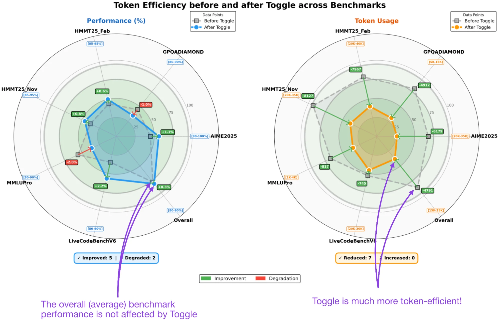

*An early instance of the same idea inside training: benchmark scores held roughly flat while token usage fell sharply. From [Sebastian Raschka’s survey](https://magazine.sebastianraschka.com/p/controlling-reasoning-effort-in-llms).*

### Bet 5 — automatic effort improves, but budget ownership stays outside the model

Providers will get better at estimating prompt difficulty, and harnesses will learn from validation and production outcomes. Yet neither can infer every business constraint from text. The model does not know the true cost of a bad migration unless the system tells it; the provider does not own the application’s latency promise; a learned router cannot approve an irreversible action merely because it is confident. Automation can allocate the envelope. Product and engineering teams still define it.

The likely end state is not “always think harder.” It is an inference market inside each request: several possible reasoning actions compete for a limited budget, and the system spends only while the expected improvement exceeds the marginal cost.

These bets would be wrong if fixed high effort remains Pareto-optimal across diverse production benchmarks, if providers converge on a portable compute unit, or if raw prompt difficulty alone predicts the correct budget without application context. Those are useful failure conditions: they turn a speculative ending into claims the field can actually test.

## Closing thoughts

**Buy reasoning where it changes the outcome.**

Reasoning effort is an engineering control over inference-time work, and it is becoming mutable runtime state. Start with a measured baseline, increase effort only for tasks that can use it, preserve cached history when the protocol allows it, and keep the level only when quality gains survive a fair comparison with latency and cost.

```text
lowest effort + required quality = right default
```

[^openai-reasoning]: OpenAI, [“Reasoning models”](https://developers.openai.com/api/docs/guides/reasoning): reasoning tokens, effort behavior, `configuration_update`, cache preservation, compaction constraints, and usage semantics.
[^openai-models]: OpenAI, [“Model guidance”](https://developers.openai.com/api/docs/guides/latest-model): current GPT-5.6 effort levels and selection guidance.
[^anthropic-thinking]: Anthropic, [“Adaptive thinking”](https://platform.claude.com/docs/en/build-with-claude/adaptive-thinking): per-request thinking decisions, effort steering, and interleaved thinking.
[^anthropic-effort]: Anthropic, [“Effort”](https://platform.claude.com/docs/en/build-with-claude/effort): response-wide and per-message effort, cache-preserving updates, and model-specific levels.
[^gemini]: Google, [“Gemini thinking”](https://ai.google.dev/gemini-api/docs/thinking): dynamic thinking, thinking levels, budgets, and model support.
[^openrouter]: OpenRouter, [“Reasoning tokens”](https://openrouter.ai/docs/guides/best-practices/reasoning-tokens): normalized effort and token-budget controls.
[^baseten]: Baseten, [“DeepSeek V3.2”](https://www.baseten.co/library/deepseek-v3-2/) and [Inference API overview](https://docs.baseten.co/reference/inference-api/overview): model-specific thinking on an OpenAI-compatible endpoint.
[^deepseek-r1]: DeepSeek, [“DeepSeek-R1: Incentivizing Reasoning Capability in LLMs via Reinforcement Learning”](https://arxiv.org/abs/2501.12948): RLVR, R1-Zero, the full R1 pipeline, and distillation.
[^qwen3]: Qwen, [“Qwen3 inference with Transformers”](https://github.com/QwenLM/Qwen3/blob/main/docs/source/inference/transformers.md): thinking and non-thinking controls.
[^gpt-oss]: OpenAI, [“gpt-oss-120b”](https://developers.openai.com/api/docs/models/gpt-oss-120b) and [“Harmony response format”](https://cookbook.openai.com/articles/openai-harmony): open weights, effort, and channel protocol.
[^deepseek-v4]: DeepSeek, [“Thinking mode”](https://api-docs.deepseek.com/guides/thinking_mode/) and [V4 encoding documentation](https://huggingface.co/deepseek-ai/DeepSeek-V4-Flash-0731/blob/main/encoding/README.md): effort levels, mappings, and prompt prefixes.
[^nemotron]: NVIDIA, [“Nemotron 3 Ultra”](https://research.nvidia.com/labs/nemotron/Nemotron-3-Ultra/) and its [technical report](https://arxiv.org/abs/2606.15007): reasoning-budget control and post-training.
[^kimi-k3]: Moonshot AI, [“Kimi K3”](https://github.com/MoonshotAI/Kimi-K3) and its [technical report](https://arxiv.org/abs/2607.24653): effort specialists, preserved thinking, and distillation.
[^glm]: Z.ai, [“GLM-5.3”](https://z.ai/blog/glm-5.3) and [“Thinking mode”](https://docs.z.ai/guides/capabilities/thinking-mode): current effort API and agentic thinking state.
[^inkling]: Thinking Machines Lab, [“Inkling: Our Open-Weights Model”](https://thinkingmachines.ai/news/introducing-inkling/): continuous effort conditioning and per-token cost in RL.
[^openai-agents]: OpenAI, [“Agents SDK models”](https://openai.github.io/openai-agents-python/models/) and [“Usage”](https://openai.github.io/openai-agents-python/usage/): reasoning settings and run-level accounting.
[^langchain-agents]: LangChain, [“Agents”](https://docs.langchain.com/oss/python/langchain/agents): middleware, dynamic model selection, state, retries, and tools.
[^glm-flash]: Z.ai, [“GLM-5.3-Flash: Frontier Intelligence, Flash Cost”](https://z.ai/blog/glm-5.3-flash): the latest Flash release and behavior across effort levels.
[^kimi-k25]: Moonshot AI, [“Kimi K2.5: Visual Agentic Intelligence”](https://arxiv.org/abs/2602.02276): Token-Efficient RL and alternating budgeted and unconstrained phases.
[^xai]: xAI, [“Reasoning”](https://docs.x.ai/developers/model-capabilities/text/reasoning): Grok 4.6 effort levels, encrypted reasoning continuity, and multi-agent effort semantics.
[^qwen38]: Qwen, [“Qwen3.8”](https://github.com/QwenLM/Qwen3.8): explicit reasoning effort and preserved thinking in the latest open-model series.
[^cot]: Wei et al., [“Chain-of-Thought Prompting Elicits Reasoning in Large Language Models”](https://arxiv.org/abs/2201.11903): worked intermediate reasoning as an inference-time capability.
[^self-consistency]: Wang et al., [“Self-Consistency Improves Chain of Thought Reasoning in Language Models”](https://arxiv.org/abs/2203.11171): sampling diverse reasoning paths and selecting their most consistent answer.
[^process-supervision]: OpenAI, [“Improving mathematical reasoning with process supervision”](https://openai.com/index/improving-mathematical-reasoning-with-process-supervision/): rewarding intermediate steps and selecting among multiple solutions.
[^o1]: OpenAI, [“Learning to reason with LLMs”](https://openai.com/index/learning-to-reason-with-llms/): the September 2024 o1 release, reinforcement learning, test-time compute, and hidden chain-of-thought.
[^snell]: Snell et al., [“Scaling LLM Test-Time Compute Optimally Can Be More Effective Than Scaling Model Parameters”](https://arxiv.org/abs/2408.03314), ICLR 2025: adaptive allocation, verifier search, revisions, and FLOPs-matched comparisons.
[^s1]: Muennighoff et al., [“s1: Simple Test-Time Scaling”](https://aclanthology.org/2025.emnlp-main.1025/), EMNLP 2025: an open implementation of budget forcing trained from 1,000 curated reasoning examples.
[^anthropic-cost]: Anthropic, [“Optimizing for cost and intelligence”](https://platform.claude.com/docs/en/about-claude/models/optimizing-for-cost-and-intelligence): vendor-run effort sweeps, SWE-bench Pro escalation results, task budgets, and multi-model routing.
[^art-tts]: Agarwal, Sengupta, and Chakraborty, [“The Art of Scaling Test-Time Compute for Large Language Models”](https://arxiv.org/abs/2512.02008): a 30-billion-token comparison across eight open models and four reasoning datasets.
[^astra]: OpenAI, [“GPT-6 Astra model guidance”](https://developers.openai.com/api/docs/guides/latest-model?model=gpt-6-astra), [“Prompt caching”](https://developers.openai.com/api/docs/guides/prompt-caching), and the [launch announcement](https://openai.com/index/gpt-6-astra/): appended effort updates, reusable prefixes, cache semantics, and the 3 September 2026 release.
[^vllm-cache]: vLLM, [“Automatic Prefix Caching”](https://docs.vllm.ai/en/latest/design/prefix_caching/): block-level reuse of matching token prefixes in open-model serving.
[^anthropic-releases]: Anthropic, [“Release notes”](https://platform.claude.com/docs/en/release-notes/overview): the 1 September 2026 per-message effort release and earlier mid-conversation system and tool changes.
[^gemini-cache]: Google, [“Context caching”](https://ai.google.dev/gemini-api/docs/caching): immutable explicit caches, implicit caching, cached-token accounting, and API boundaries.
[^qwen38-template]: Qwen, [Qwen3.8 chat template](https://huggingface.co/Qwen/Qwen3.8-27B/blob/main/chat_template.jinja): graded effort translated into an instruction in the initial system block.
[^glm-template]: Z.ai, [GLM-5.3 chat template](https://huggingface.co/zai-org/GLM-5.3/blob/main/chat_template.jinja): reasoning effort serialized into the opening control and system prefix.
[^mistral-template]: Mistral AI, [Mistral Small 4 chat template](https://huggingface.co/mistralai/Mistral-Small-4-119B-2603-NVFP4/blob/main/chat_template.jinja): reasoning effort in an early `MODEL_SETTINGS` block.
[^minimax-template]: MiniMax, [MiniMax M3 chat template](https://huggingface.co/MiniMaxAI/MiniMax-M3/blob/main/chat_template.jinja): thinking-mode instructions in the initial system prompt.
[^xai-cache]: xAI, [“Prompt caching for multi-turn conversations”](https://docs.x.ai/developers/advanced-api-usage/prompt-caching/multi-turn): exact-prefix cache behavior without a documented guarantee across effort changes.
